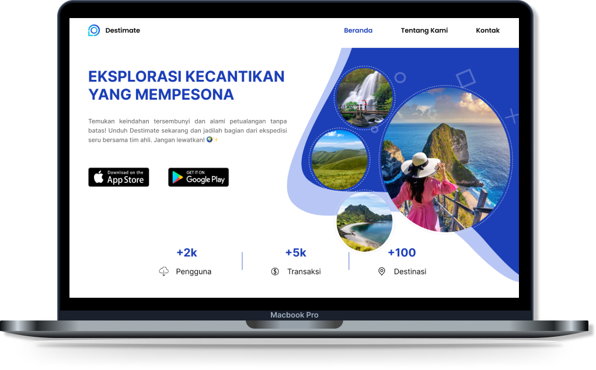

# DESTIMATE FRONTEND - CMS


<details>
  <summary>Table of Contents</summary>
  <ol>
    <li>
      <a href="#about-the-project">About The Project</a>
      <ul>
        <li><a href="#built-with">Built With</a></li>
        <li><a href="#project-structure">Project Structure</a></li>
      </ul>
    </li>
    <li>
      <a href="#getting-started">Getting Started</a>
      <ul>
        <li><a href="#installation">Installation</a></li>
      </ul>
    </li>
    <li><a href="#deployment">Deployment</a></li>
    <li><a href="#Contributors">Contributors</a></li>
  </ol>
</details>

## About The Project
This website serves as a bridge for users between the base website and the Destimate mobile application, enabling seamless integration and synchronization of data, preferences, and user interactions across both platforms..

### Built With
This project is built utilizing several technology stacks, as listed below </br>
[![React][React.js]][React-url]
[![Vite][Vite]][Vite-url]
[![Tailwind][Tailwind]][Tailwind-url]
[![Github][Github]][Github-url]
[![Netlify][Netlify]][Netlify-url]

### Project Structure
Most of the code lives in the `src` folder and looks like this:

```sh
src
|
+-- assets            # assets folder can contain all the static files such as images, etc
|
+-- components        # shared components used across the entire application
|
+-- pages             # all parts on the landing page
|
+-- providers         # all of the application providers
|
+-- routes            # routes configuration
|
+-- utils             # shared utility functions
```

## Getting Started
### Installation
To get started with the Landing Page Destimate repository, follow these steps:

1. Clone the Repository
    ```shell
    git clone https://github.com/Capstone-Tim-02/sustain-tour-frontend-landing-page.git
    ```    
2. Installation
    ```shell
    cd sustain-tour-frontend-landing-page
    npm install
    ```
3. Run the Application
    ```shell
    npm run dev
    ```

### Deployment
This project is deployed using netlify. You can access the production deployment at [this link](https://destimate.netlify.app).

## Contributors
- July Dwi Saputra
- Angga Saputra
- Agung Nurprasetya Putra
- Almira Eka Putri Maharani
- Alfitra Fadjri
- Ahmad Rizky Has
- Maulidaturrohmah
- Ganang Aji Suseno

<!-- MARKDOWN LINKS & IMAGES -->
[React.js]: https://img.shields.io/badge/React-20232A?style=for-the-badge&logo=react&logoColor=61DAFB
[Tailwind]: https://img.shields.io/badge/Tailwind_CSS-092749?style=for-the-badge&logo=tailwindcss&logoColor=06B6D4
[Github]: https://img.shields.io/badge/Github-181717?style=for-the-badge&logo=github&logoColor=ffffff
[Netlify]: https://img.shields.io/badge/Netlify-0E1E25?style=for-the-badge&logo=netlify&logoColor=00C7B7
[Vite]: https://img.shields.io/badge/Vite-1B1B23?style=for-the-badge&logo=vite&logoColor=646CFF

[React-url]: https://reactjs.org/
[Tailwind-url]: https://tailwindcss.com/
[Github-url]: https://github.com/
[Netlify-url]: https://www.netlify.com/
[Vite-url]: https://vitejs.dev/

